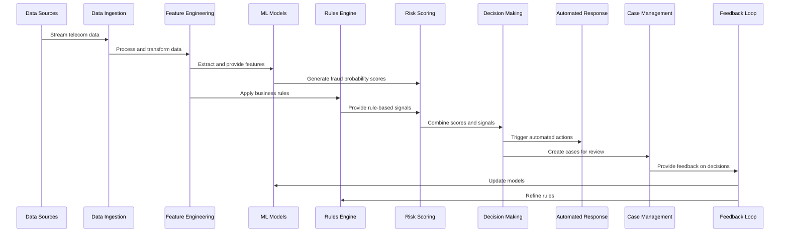

# Real-time Detection and Response Workflow

This chart illustrates the sequence of steps in the real-time fraud detection and response process.

## Description

This sequence diagram shows the end-to-end workflow for real-time fraud detection:

1. **Data Flow**:
   - Data sources stream telecom data to the ingestion layer
   - Data is processed and transformed into features
   - Features are provided to ML models and the rules engine

2. **Analysis**:
   - ML models generate fraud probability scores for different fraud types
   - Rules engine applies business rules to the data
   - Risk scoring combines ML outputs and rule-based signals

3. **Decision & Action**:
   - Decision making component determines appropriate actions
   - Automated responses are triggered for high-confidence cases
   - Cases are created for human review when needed

4. **Feedback Loop**:
   - Case management provides feedback on decisions
   - Models are updated based on confirmed fraud cases
   - Rules are refined based on operational feedback

This workflow enables real-time detection and response while continuously improving through the feedback loop, allowing the system to adapt to evolving fraud patterns.