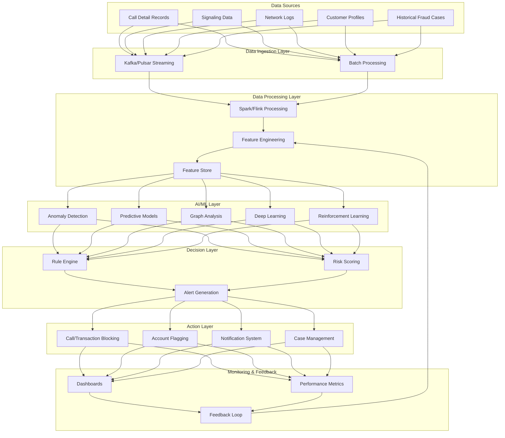

# System Architecture Overview

This chart illustrates the high-level architecture of the telecom fraud detection system, showing the main components and data flow.

## Description

This diagram shows the complete data flow through the system:

1. **Data Sources**: Various telecom data sources feed into the system
2. **Data Ingestion Layer**: Handles real-time and batch data ingestion
3. **Data Processing Layer**: Processes and transforms raw data into features
4. **AI/ML Layer**: Various ML techniques analyze the data for fraud patterns
5. **Decision Layer**: Combines ML outputs with rules to make decisions
6. **Action Layer**: Takes appropriate actions based on decisions
7. **Monitoring & Feedback**: Monitors system performance and provides feedback

The arrows indicate data flow between components, showing how information moves through the system and how the feedback loop continuously improves the system's performance.