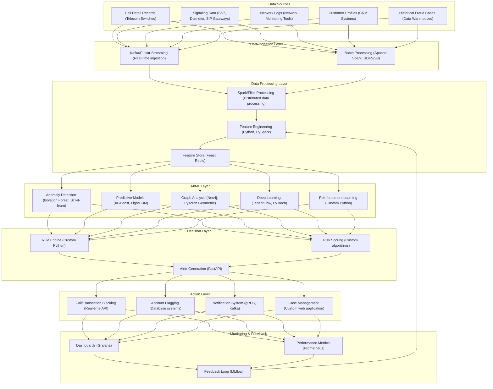

# System Architecture Overview with Technology Stack

This chart illustrates the high-level architecture of the telecom fraud detection system, showing the main components, data flow, and the technology stack used for each component.

## Description

This diagram shows the complete data flow through the system with the technology stack used for each component:

1. **Data Sources**: 
   - Call Detail Records from Telecom Switches
   - Signaling Data from SS7, Diameter, and SIP Gateways
   - Network Logs from monitoring tools
   - Customer Profiles from CRM systems
   - Historical Fraud Cases from data warehouses

2. **Data Ingestion Layer**: 
   - Real-time data ingestion using Apache Kafka/Pulsar
   - Batch processing using Apache Spark with HDFS/S3 storage

3. **Data Processing Layer**: 
   - Distributed data processing using Apache Spark/Flink
   - Feature Engineering using Python and PySpark
   - Feature Store using Feast with Redis for caching

4. **AI/ML Layer**: 
   - Anomaly Detection using Isolation Forest and Scikit-learn
   - Predictive Models using XGBoost and LightGBM
   - Graph Analysis using Neo4j and PyTorch Geometric
   - Deep Learning using TensorFlow and PyTorch
   - Reinforcement Learning using custom Python implementations

5. **Decision Layer**: 
   - Rule Engine using custom Python code
   - Risk Scoring using custom algorithms
   - Alert Generation using FastAPI

6. **Action Layer**: 
   - Call/Transaction Blocking using real-time APIs
   - Account Flagging using database systems
   - Notification System using gRPC and Kafka
   - Case Management using a custom web application

7. **Monitoring & Feedback**: 
   - Dashboards using Grafana
   - Performance Metrics using Prometheus
   - Feedback Loop using MLflow

The arrows indicate data flow between components, showing how information moves through the system and how the feedback loop continuously improves the system's performance.

## Deployment Infrastructure

The entire system is deployed using:
- Docker for containerization
- Kubernetes for orchestration
- Helm for package management
- Istio for service mesh
- Terraform for infrastructure provisioning
- CI/CD pipelines using GitHub Actions/GitLab CI