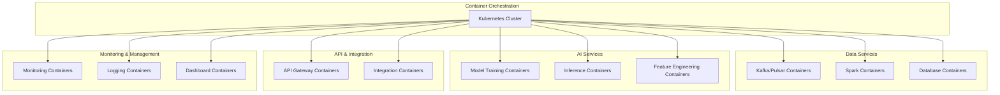

# Containerized Deployment Architecture

This chart illustrates the Kubernetes-based deployment architecture for the telecom fraud detection system.

## Description

This diagram shows the containerized deployment architecture using Kubernetes:

1. **Container Orchestration**: 
   - Kubernetes cluster serves as the foundation for orchestrating all containers
   - Provides scaling, self-healing, and service discovery capabilities

2. **Data Services**:
   - Kafka/Pulsar containers for real-time data streaming
   - Spark containers for data processing (both batch and streaming)
   - Database containers for various storage needs (TimescaleDB, Neo4j, Redis)

3. **AI Services**:
   - Model training containers for periodic model updates
   - Inference containers for real-time fraud detection
   - Feature engineering containers for feature extraction and transformation

4. **API & Integration**:
   - API gateway containers for external interfaces
   - Integration containers for connecting with telecom systems

5. **Monitoring & Management**:
   - Monitoring containers (Prometheus, Grafana)
   - Logging containers (Elasticsearch, Kibana)
   - Dashboard containers for visualization and reporting

This containerized approach provides:
- Deployment flexibility across cloud and on-premises environments
- Consistent environments across development, testing, and production
- Horizontal scaling to handle varying loads
- Isolation between components for better security and resource management
- Simplified updates and rollbacks