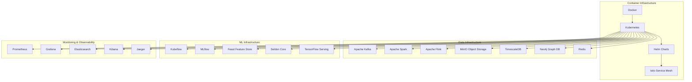
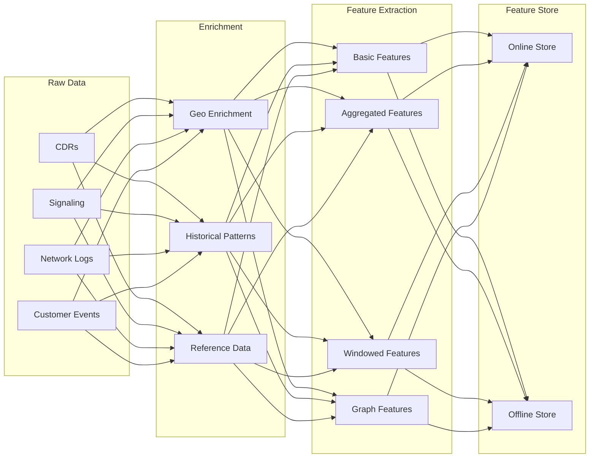
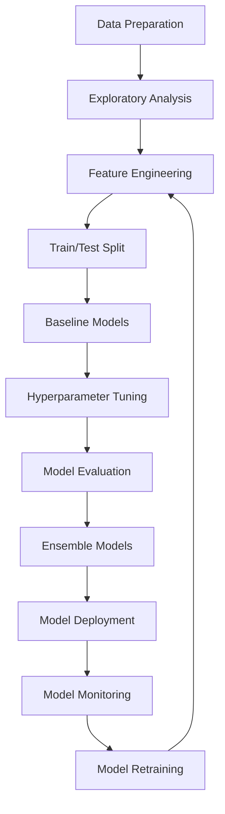
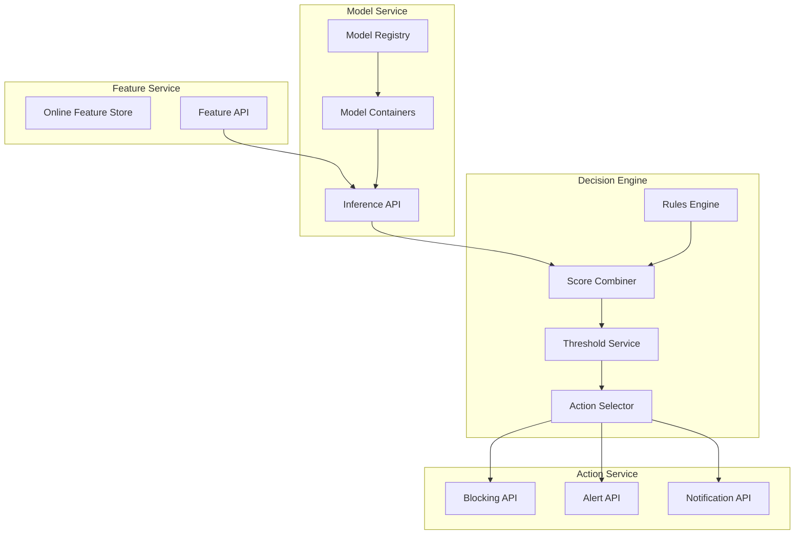

# Implementation Details for Telecom Fraud Detection AI Agent

This document provides comprehensive implementation details for building a telecom fraud detection AI agent capable of detecting and preventing fraud in telecommunication companies on a large scale.

## 1. Technical Stack Selection

### 1.1 Core Infrastructure



### 1.2 Development Stack

- **Programming Languages**: 
  - Python (ML, data processing)
  - Scala (Spark jobs)
  - Go (microservices)
  - JavaScript/TypeScript (UI)

- **Frameworks & Libraries**:
  - **ML**: TensorFlow, PyTorch, Scikit-learn, XGBoost, LightGBM
  - **Data Processing**: PySpark, Pandas, NumPy, Dask
  - **API**: FastAPI, gRPC
  - **UI**: React, D3.js
  - **Testing**: PyTest, JUnit, Locust

- **Development Tools**:
  - **IDE**: VS Code, PyCharm, IntelliJ
  - **Version Control**: Git, GitHub/GitLab
  - **CI/CD**: GitHub Actions, GitLab CI, ArgoCD
  - **Infrastructure as Code**: Terraform, Helm

## 2. Component Implementation Details

### 2.1 Data Ingestion Layer

#### Kafka Implementation

```yaml
# docker-compose.yml for local development
version: '3'
services:
  zookeeper:
    image: confluentinc/cp-zookeeper:latest
    environment:
      ZOOKEEPER_CLIENT_PORT: 2181
      
  kafka:
    image: confluentinc/cp-kafka:latest
    depends_on:
      - zookeeper
    ports:
      - "9092:9092"
    environment:
      KAFKA_BROKER_ID: 1
      KAFKA_ZOOKEEPER_CONNECT: zookeeper:2181
      KAFKA_ADVERTISED_LISTENERS: PLAINTEXT://kafka:29092,PLAINTEXT_HOST://localhost:9092
      KAFKA_LISTENER_SECURITY_PROTOCOL_MAP: PLAINTEXT:PLAINTEXT,PLAINTEXT_HOST:PLAINTEXT
      KAFKA_INTER_BROKER_LISTENER_NAME: PLAINTEXT
      KAFKA_OFFSETS_TOPIC_REPLICATION_FACTOR: 1
      
  schema-registry:
    image: confluentinc/cp-schema-registry:latest
    depends_on:
      - kafka
    ports:
      - "8081:8081"
    environment:
      SCHEMA_REGISTRY_HOST_NAME: schema-registry
      SCHEMA_REGISTRY_KAFKASTORE_CONNECTION_URL: zookeeper:2181
```

#### Kafka Topics Structure

```
telecom-fraud-detection/
├── raw-data/
│   ├── cdrs
│   ├── signaling
│   ├── network-logs
│   └── customer-events
├── processed-data/
│   ├── enriched-cdrs
│   ├── enriched-signaling
│   └── feature-events
├── model-outputs/
│   ├── irsf-scores
│   ├── wangiri-scores
│   ├── bypass-scores
│   └── account-takeover-scores
└── actions/
    ├── alerts
    ├── blocks
    └── notifications
```

#### Data Schemas (Avro Example for CDRs)

```json
{
  "type": "record",
  "name": "CDR",
  "namespace": "com.telecom.fraud.detection",
  "fields": [
    {"name": "call_id", "type": "string"},
    {"name": "timestamp", "type": "long"},
    {"name": "caller_number", "type": "string"},
    {"name": "called_number", "type": "string"},
    {"name": "call_duration", "type": "int"},
    {"name": "call_type", "type": "string"},
    {"name": "call_direction", "type": "string"},
    {"name": "switch_id", "type": "string"},
    {"name": "trunk_id", "type": "string"},
    {"name": "billing_type", "type": "string"},
    {"name": "call_status", "type": "string"},
    {"name": "disconnect_reason", "type": "string"},
    {"name": "source_country", "type": "string"},
    {"name": "destination_country", "type": "string"},
    {"name": "roaming_status", "type": "boolean", "default": false},
    {"name": "service_type", "type": "string"}
  ]
}
```

### 2.2 Data Processing Layer

#### Spark Streaming Job Structure

```
spark-streaming/
├── src/
│   ├── main/
│   │   ├── scala/
│   │   │   └── com/
│   │   │       └── telecom/
│   │   │           └── fraud/
│   │   │               ├── config/
│   │   │               │   └── AppConfig.scala
│   │   │               ├── models/
│   │   │               │   └── DataModels.scala
│   │   │               ├── processors/
│   │   │               │   ├── CDRProcessor.scala
│   │   │               │   └── SignalingProcessor.scala
│   │   │               ├── enrichers/
│   │   │               │   ├── GeoEnricher.scala
│   │   │               │   └── CustomerEnricher.scala
│   │   │               ├── features/
│   │   │               │   ├── IRSFFeatureExtractor.scala
│   │   │               │   ├── WangiriFeatureExtractor.scala
│   │   │               │   ├── BypassFeatureExtractor.scala
│   │   │               │   └── AccountTakeoverFeatureExtractor.scala
│   │   │               └── StreamingApp.scala
│   │   └── resources/
│   │       ├── application.conf
│   │       └── log4j.properties
│   └── test/
│       └── scala/
│           └── com/
│               └── telecom/
│                   └── fraud/
│                       └── processors/
│                           └── ProcessorTests.scala
├── build.sbt
└── README.md
```

#### Feature Engineering Pipeline



### 2.3 ML Model Implementation

#### Model Development Workflow



#### Model Architecture Examples

**IRSF Detection Model (XGBoost)**

```python
# Example XGBoost model for IRSF detection
import xgboost as xgb
from sklearn.metrics import precision_recall_curve, auc
from sklearn.model_selection import train_test_split

# Feature columns for IRSF detection
feature_columns = [
    'call_duration', 'destination_risk_score', 'time_of_day', 
    'day_of_week', 'call_frequency_1h', 'call_frequency_24h',
    'avg_duration_7d', 'international_call_ratio', 'premium_number_ratio',
    'destination_country_code', 'destination_network_type',
    'customer_tenure', 'customer_segment', 'billing_type',
    'historical_spend', 'deviation_from_average_spend'
]

# Load and prepare data
X = df[feature_columns]
y = df['is_fraud']

# Split data
X_train, X_test, y_train, y_test = train_test_split(X, y, test_size=0.2, random_state=42)

# Define model parameters
params = {
    'objective': 'binary:logistic',
    'eval_metric': 'auc',
    'eta': 0.1,
    'max_depth': 6,
    'min_child_weight': 1,
    'subsample': 0.8,
    'colsample_bytree': 0.8,
    'scale_pos_weight': 50,  # Adjust for class imbalance
    'tree_method': 'hist'
}

# Train model
dtrain = xgb.DMatrix(X_train, label=y_train)
dtest = xgb.DMatrix(X_test, label=y_test)

model = xgb.train(
    params,
    dtrain,
    num_boost_round=1000,
    evals=[(dtrain, 'train'), (dtest, 'test')],
    early_stopping_rounds=50,
    verbose_eval=100
)

# Evaluate model
y_pred = model.predict(dtest)
precision, recall, thresholds = precision_recall_curve(y_test, y_pred)
pr_auc = auc(recall, precision)
print(f"Precision-Recall AUC: {pr_auc:.4f}")

# Save model
model.save_model('irsf_detection_model.json')
```

**Wangiri Detection Model (LSTM)**

```python
# Example LSTM model for Wangiri fraud detection
import tensorflow as tf
from tensorflow.keras.models import Sequential
from tensorflow.keras.layers import LSTM, Dense, Dropout
from tensorflow.keras.callbacks import EarlyStopping, ModelCheckpoint

# Define model
def create_wangiri_model(input_shape):
    model = Sequential([
        LSTM(64, input_shape=input_shape, return_sequences=True),
        Dropout(0.2),
        LSTM(32),
        Dropout(0.2),
        Dense(16, activation='relu'),
        Dense(1, activation='sigmoid')
    ])
    
    model.compile(
        optimizer='adam',
        loss='binary_crossentropy',
        metrics=['accuracy', tf.keras.metrics.AUC(), tf.keras.metrics.Precision(), tf.keras.metrics.Recall()]
    )
    
    return model

# Prepare sequence data (time-series of calls)
# X_train shape: (samples, time_steps, features)
# y_train shape: (samples,)

# Create and train model
model = create_wangiri_model((time_steps, n_features))

callbacks = [
    EarlyStopping(patience=5, restore_best_weights=True),
    ModelCheckpoint('wangiri_model.h5', save_best_only=True)
]

history = model.fit(
    X_train, y_train,
    validation_data=(X_val, y_val),
    epochs=50,
    batch_size=64,
    callbacks=callbacks
)

# Evaluate model
results = model.evaluate(X_test, y_test)
print(f"Test Loss: {results[0]:.4f}")
print(f"Test Accuracy: {results[1]:.4f}")
print(f"Test AUC: {results[2]:.4f}")
print(f"Test Precision: {results[3]:.4f}")
print(f"Test Recall: {results[4]:.4f}")
```

**Graph-based Fraud Detection (PyG)**

```python
# Example Graph Neural Network for fraud network detection
import torch
import torch.nn.functional as F
from torch_geometric.nn import GCNConv, SAGEConv, global_mean_pool
from torch_geometric.data import Data, DataLoader

# Define GNN model
class FraudGNN(torch.nn.Module):
    def __init__(self, in_channels, hidden_channels, out_channels):
        super(FraudGNN, self).__init__()
        self.conv1 = SAGEConv(in_channels, hidden_channels)
        self.conv2 = SAGEConv(hidden_channels, hidden_channels)
        self.conv3 = SAGEConv(hidden_channels, hidden_channels)
        self.lin = torch.nn.Linear(hidden_channels, out_channels)

    def forward(self, x, edge_index, batch):
        # Node embedding
        x = self.conv1(x, edge_index)
        x = F.relu(x)
        x = F.dropout(x, p=0.2, training=self.training)
        
        x = self.conv2(x, edge_index)
        x = F.relu(x)
        x = F.dropout(x, p=0.2, training=self.training)
        
        x = self.conv3(x, edge_index)
        
        # Graph-level readout
        x = global_mean_pool(x, batch)
        
        # Final classifier
        x = self.lin(x)
        return F.log_softmax(x, dim=1)

# Create model
model = FraudGNN(in_channels=node_features, hidden_channels=64, out_channels=2)
optimizer = torch.optim.Adam(model.parameters(), lr=0.01)

# Training loop
def train():
    model.train()
    total_loss = 0
    for data in train_loader:
        optimizer.zero_grad()
        out = model(data.x, data.edge_index, data.batch)
        loss = F.nll_loss(out, data.y)
        loss.backward()
        optimizer.step()
        total_loss += loss.item() * data.num_graphs
    return total_loss / len(train_dataset)

# Evaluation
def test(loader):
    model.eval()
    correct = 0
    for data in loader:
        out = model(data.x, data.edge_index, data.batch)
        pred = out.argmax(dim=1)
        correct += int((pred == data.y).sum())
    return correct / len(loader.dataset)
```

### 2.4 Real-time Scoring and Decision Engine

#### Scoring Service Architecture



#### Decision Engine Implementation

```python
# Example Decision Engine implementation
from pydantic import BaseModel
from typing import List, Dict, Any
import numpy as np

class FraudScore(BaseModel):
    call_id: str
    timestamp: int
    caller_id: str
    called_id: str
    irsf_score: float
    wangiri_score: float
    bypass_score: float
    account_takeover_score: float
    feature_values: Dict[str, Any]
    
class RuleResult(BaseModel):
    rule_id: str
    rule_name: str
    triggered: bool
    confidence: float
    reason: str

class DecisionResult(BaseModel):
    call_id: str
    timestamp: int
    overall_risk_score: float
    fraud_type: str
    confidence: float
    recommended_action: str
    block_recommended: bool
    alert_recommended: bool
    explanation: List[str]
    
class DecisionEngine:
    def __init__(self, config):
        self.config = config
        self.rules_engine = RulesEngine(config["rules"])
        self.thresholds = config["thresholds"]
        
    def evaluate(self, fraud_score: FraudScore) -> DecisionResult:
        # Apply business rules
        rule_results = self.rules_engine.evaluate(fraud_score)
        
        # Combine ML scores and rule results
        combined_score = self._combine_scores(fraud_score, rule_results)
        
        # Determine fraud type with highest probability
        fraud_types = {
            "IRSF": fraud_score.irsf_score,
            "Wangiri": fraud_score.wangiri_score,
            "Bypass": fraud_score.bypass_score,
            "Account Takeover": fraud_score.account_takeover_score
        }
        fraud_type = max(fraud_types, key=fraud_types.get)
        
        # Determine confidence
        confidence = fraud_types[fraud_type]
        
        # Determine actions based on thresholds
        block_threshold = self.thresholds[fraud_type.lower()]["block"]
        alert_threshold = self.thresholds[fraud_type.lower()]["alert"]
        
        block_recommended = combined_score >= block_threshold
        alert_recommended = combined_score >= alert_threshold
        
        # Generate explanation
        explanation = self._generate_explanation(fraud_score, rule_results, fraud_type)
        
        # Determine recommended action
        if block_recommended:
            recommended_action = "BLOCK"
        elif alert_recommended:
            recommended_action = "ALERT"
        else:
            recommended_action = "MONITOR"
        
        return DecisionResult(
            call_id=fraud_score.call_id,
            timestamp=fraud_score.timestamp,
            overall_risk_score=combined_score,
            fraud_type=fraud_type,
            confidence=confidence,
            recommended_action=recommended_action,
            block_recommended=block_recommended,
            alert_recommended=alert_recommended,
            explanation=explanation
        )
    
    def _combine_scores(self, fraud_score, rule_results):
        # Weighted combination of ML scores and rule results
        ml_weight = self.config["weights"]["ml_score"]
        rule_weight = self.config["weights"]["rules"]
        
        # Get the highest ML score
        ml_scores = [
            fraud_score.irsf_score,
            fraud_score.wangiri_score,
            fraud_score.bypass_score,
            fraud_score.account_takeover_score
        ]
        max_ml_score = max(ml_scores)
        
        # Calculate rule score (average of triggered rules)
        triggered_rules = [r for r in rule_results if r.triggered]
        rule_score = np.mean([r.confidence for r in triggered_rules]) if triggered_rules else 0
        
        # Combine scores
        combined_score = (ml_weight * max_ml_score) + (rule_weight * rule_score)
        
        return min(combined_score, 1.0)  # Cap at 1.0
    
    def _generate_explanation(self, fraud_score, rule_results, fraud_type):
        explanation = []
        
        # Add ML model explanation
        if fraud_type == "IRSF":
            explanation.append(f"IRSF fraud score: {fraud_score.irsf_score:.2f}")
            # Add feature-based explanations
            if fraud_score.feature_values.get("international_call_ratio", 0) > 0.8:
                explanation.append("High ratio of international calls detected")
            if fraud_score.feature_values.get("premium_number_ratio", 0) > 0.5:
                explanation.append("High ratio of calls to premium numbers detected")
        
        elif fraud_type == "Wangiri":
            explanation.append(f"Wangiri fraud score: {fraud_score.wangiri_score:.2f}")
            if fraud_score.feature_values.get("avg_call_duration", 0) < 10:
                explanation.append("Pattern of very short duration calls detected")
            if fraud_score.feature_values.get("callback_rate", 0) > 0.3:
                explanation.append("High callback rate detected")
        
        # Add rule-based explanations
        for rule in rule_results:
            if rule.triggered:
                explanation.append(f"Rule triggered: {rule.rule_name} ({rule.reason})")
        
        return explanation
```

### 2.5 Containerized Deployment

#### Kubernetes Deployment Example

```yaml
# Example Kubernetes deployment for fraud detection service
apiVersion: apps/v1
kind: Deployment
metadata:
  name: fraud-detection-service
  namespace: telecom-fraud
spec:
  replicas: 3
  selector:
    matchLabels:
      app: fraud-detection
  template:
    metadata:
      labels:
        app: fraud-detection
    spec:
      containers:
      - name: fraud-detection-api
        image: telecom/fraud-detection:v1.0.0
        ports:
        - containerPort: 8080
        resources:
          requests:
            memory: "1Gi"
            cpu: "500m"
          limits:
            memory: "2Gi"
            cpu: "1000m"
        env:
        - name: KAFKA_BOOTSTRAP_SERVERS
          valueFrom:
            configMapKeyRef:
              name: kafka-config
              key: bootstrap.servers
        - name: FEATURE_STORE_URL
          valueFrom:
            configMapKeyRef:
              name: feature-store-config
              key: url
        - name: MODEL_REGISTRY_URL
          valueFrom:
            configMapKeyRef:
              name: mlflow-config
              key: url
        volumeMounts:
        - name: config-volume
          mountPath: /app/config
        livenessProbe:
          httpGet:
            path: /health
            port: 8080
          initialDelaySeconds: 30
          periodSeconds: 10
        readinessProbe:
          httpGet:
            path: /ready
            port: 8080
          initialDelaySeconds: 5
          periodSeconds: 5
      volumes:
      - name: config-volume
        configMap:
          name: fraud-detection-config
---
apiVersion: v1
kind: Service
metadata:
  name: fraud-detection-service
  namespace: telecom-fraud
spec:
  selector:
    app: fraud-detection
  ports:
  - port: 80
    targetPort: 8080
  type: ClusterIP
```

#### Helm Chart Structure

```
fraud-detection-helm/
├── Chart.yaml
├── values.yaml
├── templates/
│   ├── _helpers.tpl
│   ├── configmap.yaml
│   ├── deployment.yaml
│   ├── hpa.yaml
│   ├── ingress.yaml
│   ├── service.yaml
│   └── serviceaccount.yaml
└── charts/
    ├── kafka/
    ├── spark/
    ├── feature-store/
    └── model-serving/
```

## 3. Testing Strategy

### 3.1 Unit Testing

```python
# Example unit test for feature extraction
import unittest
from fraud_detection.features import IRSFFeatureExtractor

class TestIRSFFeatureExtractor(unittest.TestCase):
    def setUp(self):
        self.extractor = IRSFFeatureExtractor()
        self.sample_cdr = {
            "call_id": "12345",
            "timestamp": 1625097600,
            "caller_number": "+1234567890",
            "called_number": "+9876543210",
            "call_duration": 120,
            "call_type": "VOICE",
            "call_direction": "OUTBOUND",
            "destination_country": "XYZ"
        }
        
    def test_extract_destination_risk(self):
        risk_score = self.extractor.extract_destination_risk(self.sample_cdr)
        self.assertIsInstance(risk_score, float)
        self.assertTrue(0 <= risk_score <= 1)
        
    def test_extract_time_features(self):
        time_features = self.extractor.extract_time_features(self.sample_cdr)
        self.assertIn("hour_of_day", time_features)
        self.assertIn("day_of_week", time_features)
        self.assertTrue(0 <= time_features["hour_of_day"] <= 23)
        self.assertTrue(0 <= time_features["day_of_week"] <= 6)
        
    def test_high_risk_country(self):
        # Test with known high-risk country
        high_risk_cdr = self.sample_cdr.copy()
        high_risk_cdr["destination_country"] = "XYZ"  # Assuming XYZ is high-risk
        risk_score = self.extractor.extract_destination_risk(high_risk_cdr)
        self.assertGreater(risk_score, 0.7)
        
        # Test with low-risk country
        low_risk_cdr = self.sample_cdr.copy()
        low_risk_cdr["destination_country"] = "USA"  # Assuming USA is low-risk
        risk_score = self.extractor.extract_destination_risk(low_risk_cdr)
        self.assertLess(risk_score, 0.3)

if __name__ == '__main__':
    unittest.main()
```

### 3.2 Integration Testing

```python
# Example integration test for fraud detection pipeline
import unittest
from fraud_detection.pipeline import FraudDetectionPipeline
from fraud_detection.models import ModelService
from fraud_detection.features import FeatureService
from fraud_detection.decision import DecisionEngine
import pandas as pd

class TestFraudDetectionPipeline(unittest.TestCase):
    def setUp(self):
        # Mock services
        self.feature_service = FeatureService(config={"mock": True})
        self.model_service = ModelService(config={"mock": True})
        self.decision_engine = DecisionEngine(config={"mock": True})
        
        # Create pipeline
        self.pipeline = FraudDetectionPipeline(
            feature_service=self.feature_service,
            model_service=self.model_service,
            decision_engine=self.decision_engine
        )
        
        # Sample data
        self.sample_cdrs = pd.DataFrame({
            "call_id": ["12345", "12346", "12347"],
            "timestamp": [1625097600, 1625097700, 1625097800],
            "caller_number": ["+1234567890", "+1234567891", "+1234567892"],
            "called_number": ["+9876543210", "+9876543211", "+9876543212"],
            "call_duration": [120, 5, 300],
            "call_type": ["VOICE", "VOICE", "VOICE"],
            "call_direction": ["OUTBOUND", "OUTBOUND", "OUTBOUND"],
            "destination_country": ["XYZ", "ABC", "USA"]
        })
        
    def test_end_to_end_pipeline(self):
        # Process batch of CDRs
        results = self.pipeline.process_batch(self.sample_cdrs)
        
        # Check results
        self.assertEqual(len(results), 3)
        self.assertIn("call_id", results[0])
        self.assertIn("fraud_type", results[0])
        self.assertIn("risk_score", results[0])
        self.assertIn("recommended_action", results[0])
        
        # Check at least one high-risk call is detected
        high_risk_calls = [r for r in results if r["risk_score"] > 0.7]
        self.assertGreaterEqual(len(high_risk_calls), 1)
        
        # Check Wangiri detection for very short calls
        short_call = [r for r in results if r["call_id"] == "12346"][0]
        self.assertEqual(short_call["fraud_type"], "Wangiri")
        
    def test_feature_extraction(self):
        features = self.pipeline.extract_features(self.sample_cdrs)
        self.assertEqual(len(features), 3)
        self.assertGreater(len(features[0].keys()), 10)  # Should have multiple features
        
    def test_model_scoring(self):
        features = self.pipeline.extract_features(self.sample_cdrs)
        scores = self.pipeline.score_features(features)
        self.assertEqual(len(scores), 3)
        self.assertIn("irsf_score", scores[0])
        self.assertIn("wangiri_score", scores[0])
        self.assertIn("bypass_score", scores[0])
        self.assertIn("account_takeover_score", scores[0])

if __name__ == '__main__':
    unittest.main()
```

### 3.3