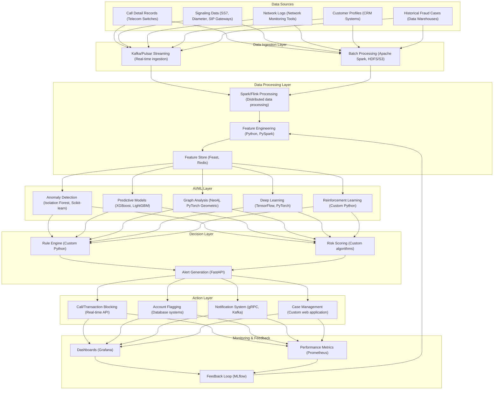
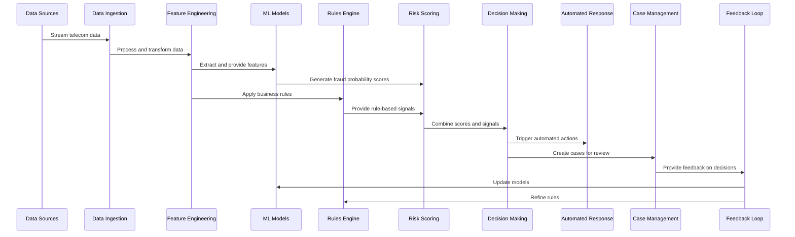

# System Architecture with Technology Stack

This document provides a comprehensive overview of the telecom fraud detection system architecture with the specific technologies used for each component.

## High-Level Architecture

## Component Details

### 1. Data Sources
- **Call Detail Records (CDRs)**: Raw call metadata from telecom switches
  - *Technology*: Telecom switch APIs, SFTP/FTP transfers, database connectors
- **Signaling Data**: SS7, Diameter, and SIP signaling information
  - *Technology*: Signaling gateways, protocol analyzers
- **Network Logs**: System and network event logs
  - *Technology*: Syslog, ELK stack collectors
- **Customer Profiles**: Customer account and usage information
  - *Technology*: CRM system APIs, database connectors
- **Historical Fraud Cases**: Previously identified fraud incidents
  - *Technology*: Data warehouse connectors, CSV/JSON exports

### 2. Data Ingestion Layer
- **Real-time Streaming**:
  - *Technology*: Apache Kafka/Pulsar
  - *Components*: Producers, consumers, topics, partitions
  - *Features*: Schema registry, exactly-once delivery, compacted topics
- **Batch Processing**:
  - *Technology*: Apache Spark, HDFS/S3
  - *Components*: Batch jobs, schedulers
  - *Features*: Parallel processing, fault tolerance

### 3. Data Processing Layer
- **Stream Processing**:
  - *Technology*: Apache Flink/Spark Streaming
  - *Components*: Streaming jobs, windowing operations
  - *Features*: Stateful processing, event time processing
- **Feature Engineering**:
  - *Technology*: Python, PySpark
  - *Components*: Feature extractors, transformers
  - *Features*: Real-time and batch feature computation
- **Feature Store**:
  - *Technology*: Feast, Redis
  - *Components*: Online store, offline store
  - *Features*: Feature versioning, point-in-time correctness

### 4. AI/ML Layer
- **Anomaly Detection**:
  - *Technology*: Isolation Forest, Scikit-learn
  - *Components*: Unsupervised models
  - *Features*: Outlier detection, novelty detection
- **Predictive Models**:
  - *Technology*: XGBoost, LightGBM
  - *Components*: Gradient boosting models
  - *Features*: Classification, ranking
- **Graph Analysis**:
  - *Technology*: Neo4j, PyTorch Geometric
  - *Components*: Graph databases, GNN models
  - *Features*: Network analysis, pattern detection
- **Deep Learning**:
  - *Technology*: TensorFlow, PyTorch
  - *Components*: LSTM, Transformer models
  - *Features*: Sequence analysis, pattern recognition
- **Reinforcement Learning**:
  - *Technology*: Custom Python implementations
  - *Components*: RL agents, environments
  - *Features*: Adaptive strategies, exploration/exploitation

### 5. Decision Layer
- **Rule Engine**:
  - *Technology*: Custom Python implementation
  - *Components*: Rule evaluators, rule repository
  - *Features*: Business rule application, rule versioning
- **Risk Scoring**:
  - *Technology*: Custom algorithms
  - *Components*: Scoring services, threshold management
  - *Features*: Multi-model scoring, confidence calculation
- **Alert Generation**:
  - *Technology*: FastAPI
  - *Components*: API services, alert formatters
  - *Features*: Real-time alerts, prioritization

### 6. Action Layer
- **Call/Transaction Blocking**:
  - *Technology*: Real-time APIs
  - *Components*: Blocking services, telecom integrations
  - *Features*: Immediate intervention, selective blocking
- **Account Flagging**:
  - *Technology*: Database systems
  - *Components*: Flagging services, status management
  - *Features*: Risk level indication, investigation triggers
- **Notification System**:
  - *Technology*: gRPC, Kafka
  - *Components*: Notification services, delivery management
  - *Features*: Multi-channel notifications, delivery confirmation
- **Case Management**:
  - *Technology*: Custom web application
  - *Components*: Case tracking, workflow management
  - *Features*: Investigation tools, resolution tracking

### 7. Monitoring & Feedback
- **Dashboards**:
  - *Technology*: Grafana
  - *Components*: Visualization panels, data sources
  - *Features*: Real-time monitoring, historical analysis
- **Performance Metrics**:
  - *Technology*: Prometheus
  - *Components*: Metrics collectors, alerting rules
  - *Features*: System health monitoring, performance tracking
- **Feedback Loop**:
  - *Technology*: MLflow
  - *Components*: Experiment tracking, model registry
  - *Features*: Model versioning, performance comparison

## Deployment Infrastructure

The entire system is deployed using a containerized approach:

- **Containerization**: Docker
  - *Components*: Dockerfiles, container images
  - *Features*: Isolated environments, reproducible builds

- **Orchestration**: Kubernetes
  - *Components*: Deployments, services, pods
  - *Features*: Auto-scaling, self-healing, rolling updates

- **Package Management**: Helm
  - *Components*: Charts, templates, values
  - *Features*: Parameterized deployments, versioning

- **Service Mesh**: Istio
  - *Components*: Virtual services, gateways
  - *Features*: Traffic management, security, observability

- **Infrastructure as Code**: Terraform
  - *Components*: Providers, modules, resources
  - *Features*: Declarative infrastructure, state management

- **CI/CD**: GitHub Actions/GitLab CI
  - *Components*: Pipelines, workflows, jobs
  - *Features*: Automated testing, deployment, validation

## Data Flow Sequence

## Technical Requirements

### Performance
- **Latency**: < 500ms for real-time fraud detection
- **Throughput**: 10,000+ calls per second
- **Availability**: 99.99% uptime for critical components
- **Scalability**: Horizontal scaling for handling peak loads

### Security
- **Data Encryption**: Both at rest and in transit
- **Access Control**: Role-based access control for all components
- **Audit Logging**: Comprehensive logging of all system actions
- **Compliance**: GDPR, PCI-DSS, and telecom regulatory requirements
- **Secure APIs**: Authentication and authorization for all APIs

### Deployment
- **Multi-environment**: Development, testing, staging, and production
- **Zero-downtime Deployment**: Rolling updates for all services
- **Backup and Recovery**: Regular backups and disaster recovery procedures
- **Monitoring and Alerting**: Comprehensive monitoring of all components