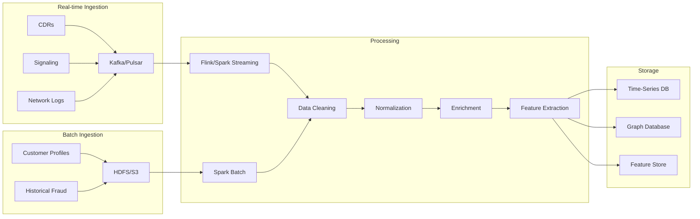

# Data Ingestion and Processing

This chart details the flow of data from various sources through the ingestion and processing pipeline to the storage layer.

## Description

This diagram illustrates the detailed data flow from sources to storage:

1. **Real-time Ingestion**: 
   - Call Detail Records (CDRs), signaling data, and network logs are ingested in real-time through Kafka/Pulsar
   - These data sources require immediate processing for fraud detection

2. **Batch Ingestion**:
   - Customer profiles and historical fraud data are processed in batches
   - These data sources are stored in HDFS or S3-compatible storage for periodic processing

3. **Processing Pipeline**:
   - Real-time data is processed through Flink/Spark Streaming
   - Batch data is processed through Spark Batch jobs
   - All data goes through cleaning, normalization, and enrichment stages
   - Feature extraction transforms raw data into ML-ready features

4. **Storage Layer**:
   - Time-Series DB (TimescaleDB) stores temporal data for trend analysis
   - Graph Database (Neo4j) stores relationship data for network analysis
   - Feature Store (Feast) maintains features for ML model training and inference

This architecture enables both real-time fraud detection and deeper batch analysis, combining the strengths of both approaches.