# AI/ML Model Architecture

This chart illustrates the machine learning model architecture for the different fraud types, showing how features flow through specialized models.

```mermaid
flowchart TD
    subgraph "Feature Store"
        RT_FEAT[Real-time Features]
        HIST_FEAT[Historical Features]
        CUST_FEAT[Customer Features]
        NET_FEAT[Network Features]
    end

    subgraph "Model Types"
        subgraph "IRSF Detection"
            IRSF_ANOM[Anomaly Detection]
            IRSF_PATTERN[Call Pattern Analysis]
            IRSF_DEST[Destination Analysis]
        end

        subgraph "Wangiri Detection"
            WANG_DUR[Call Duration Analysis]
            WANG_PATTERN[Ring Pattern Detection]
            WANG_CALLBACK[Callback Prediction]
        end

        subgraph "Bypass Detection"
            BP_SIG[Signaling Analysis]
            BP_ROUTE[Route Analysis]
            BP_QUALITY[Quality Metrics]
        end

        subgraph "Account Takeover"
            ATO_BEHAV[Behavioral Biometrics]
            ATO_AUTH[Authentication Patterns]
            ATO_DEVICE[Device Fingerprinting]
        end
    end

    subgraph "Model Techniques"
        ISOLATION[Isolation Forest]
        LSTM[LSTM Networks]
        GNN[Graph Neural Networks]
        XGB[XGBoost/LightGBM]
        DNN[Deep Neural Networks]
        RL[Reinforcement Learning]
    end

    RT_FEAT & HIST_FEAT & CUST_FEAT & NET_FEAT --> IRSF_ANOM & IRSF_PATTERN & IRSF_DEST
    RT_FEAT & HIST_FEAT & CUST_FEAT & NET_FEAT --> WANG_DUR & WANG_PATTERN & WANG_CALLBACK
    RT_FEAT & HIST_FEAT & CUST_FEAT & NET_FEAT --> BP_SIG & BP_ROUTE & BP_QUALITY
    RT_FEAT & HIST_FEAT & CUST_FEAT & NET_FEAT --> ATO_BEHAV & ATO_AUTH & ATO_DEVICE

    IRSF_ANOM & WANG_DUR & BP_SIG & ATO_BEHAV --> ISOLATION
    IRSF_PATTERN & WANG_PATTERN & ATO_AUTH --> LSTM
    IRSF_DEST & BP_ROUTE --> GNN
    WANG_CALLBACK & BP_QUALITY --> XGB
    ATO_DEVICE --> DNN
    IRSF_PATTERN & WANG_PATTERN & BP_ROUTE & ATO_BEHAV --> RL
```

## Description

This diagram shows the specialized machine learning approach for each fraud type:

1. **Feature Store**: The central repository of features from different sources:
   - Real-time features from current activity
   - Historical features from past behavior
   - Customer features from profile information
   - Network features from telecom infrastructure

2. **Fraud-Specific Models**: Each fraud type has specialized detection components:
   - **IRSF Detection**: Focuses on anomaly detection, call patterns, and destination risk
   - **Wangiri Detection**: Analyzes call duration, ring patterns, and callback likelihood
   - **Bypass Detection**: Examines signaling data, routing information, and call quality
   - **Account Takeover**: Monitors behavioral biometrics, authentication patterns, and device information

3. **ML Techniques**: Different algorithms are applied based on the detection needs:
   - **Isolation Forest**: For anomaly detection in unusual patterns
   - **LSTM Networks**: For sequence analysis in call patterns
   - **Graph Neural Networks**: For analyzing network relationships
   - **XGBoost/LightGBM**: For classification tasks with structured data
   - **Deep Neural Networks**: For complex pattern recognition
   - **Reinforcement Learning**: For adaptive detection strategies

This multi-model approach allows for specialized detection of each fraud type while leveraging common features, providing both precision and efficiency in fraud detection.