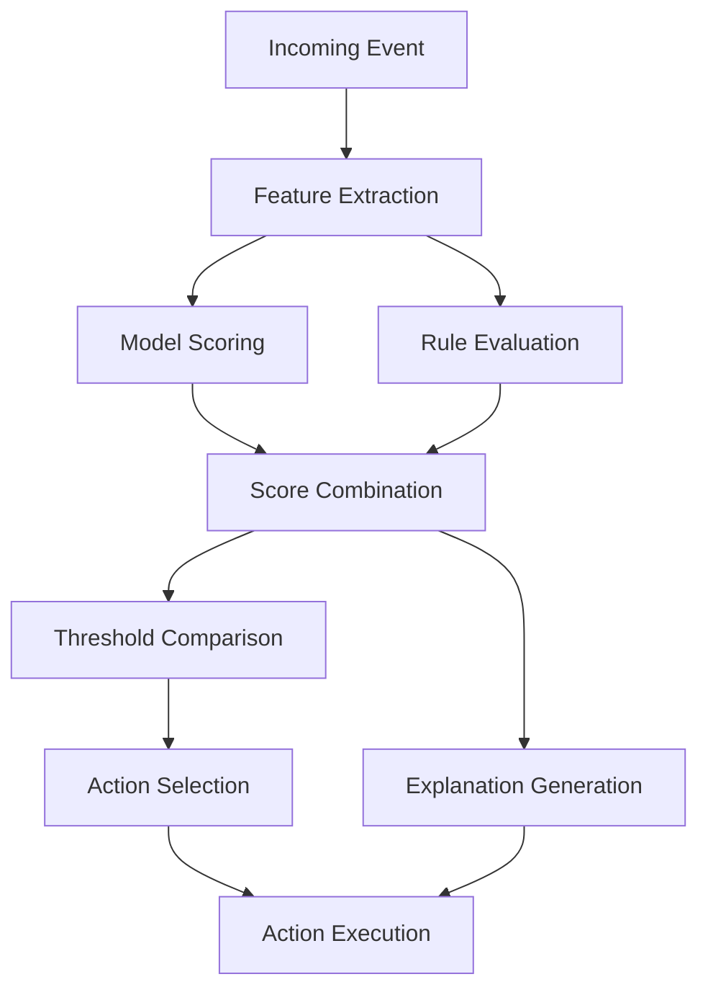

# Decision Engine

The Decision Engine is a critical component of the telecom fraud detection system, responsible for combining model outputs, applying business rules, and determining appropriate actions.

## Components

The Decision Engine consists of several key components:

### 1. Rules Engine

The Rules Engine applies business rules to the data and model outputs. These rules can be based on:
- Industry knowledge
- Regulatory requirements
- Known fraud patterns
- Customer-specific policies

Key files:
- `rules/rule_definitions.py` - Definitions of business rules
- `rules/rule_evaluator.py` - Logic for evaluating rules against data

### 2. Risk Scoring

The Risk Scoring component combines multiple signals to calculate an overall risk score:
- ML model predictions for different fraud types
- Rule evaluation results
- Historical risk patterns
- Customer risk profiles

Key files:
- `scoring/score_combiner.py` - Logic for combining different risk signals
- `scoring/threshold_manager.py` - Management of risk thresholds

### 3. Action Determination

The Action Determination component decides what actions to take based on risk scores:
- Call blocking
- Account flagging
- Alert generation
- Case creation

Key files:
- `actions/action_selector.py` - Logic for selecting appropriate actions
- `actions/action_executor.py` - Execution of selected actions

### 4. Explanation Generation

The Explanation Generation component provides human-readable explanations for decisions:
- Feature importance analysis
- Rule triggering explanations
- Confidence metrics
- Historical context

Key files:
- `explanation/explanation_generator.py` - Generation of decision explanations

## Decision Flow



## Decision Engine Implementation

The Decision Engine is implemented as a stateless service that:
1. Receives events and feature data
2. Retrieves model predictions
3. Applies business rules
4. Calculates risk scores
5. Determines appropriate actions
6. Generates explanations
7. Executes or recommends actions

Example implementation:

```python
class DecisionEngine:
    def __init__(self, config):
        self.config = config
        self.rules_engine = RulesEngine(config["rules"])
        self.thresholds = config["thresholds"]
        
    def evaluate(self, fraud_score: FraudScore) -> DecisionResult:
        # Apply business rules
        rule_results = self.rules_engine.evaluate(fraud_score)
        
        # Combine ML scores and rule results
        combined_score = self._combine_scores(fraud_score, rule_results)
        
        # Determine fraud type with highest probability
        fraud_types = {
            "IRSF": fraud_score.irsf_score,
            "Wangiri": fraud_score.wangiri_score,
            "Bypass": fraud_score.bypass_score,
            "Account Takeover": fraud_score.account_takeover_score
        }
        fraud_type = max(fraud_types, key=fraud_types.get)
        
        # Determine confidence
        confidence = fraud_types[fraud_type]
        
        # Determine actions based on thresholds
        block_threshold = self.thresholds[fraud_type.lower()]["block"]
        alert_threshold = self.thresholds[fraud_type.lower()]["alert"]
        
        block_recommended = combined_score >= block_threshold
        alert_recommended = combined_score >= alert_threshold
        
        # Generate explanation
        explanation = self._generate_explanation(fraud_score, rule_results, fraud_type)
        
        # Determine recommended action
        if block_recommended:
            recommended_action = "BLOCK"
        elif alert_recommended:
            recommended_action = "ALERT"
        else:
            recommended_action = "MONITOR"
        
        return DecisionResult(
            call_id=fraud_score.call_id,
            timestamp=fraud_score.timestamp,
            overall_risk_score=combined_score,
            fraud_type=fraud_type,
            confidence=confidence,
            recommended_action=recommended_action,
            block_recommended=block_recommended,
            alert_recommended=alert_recommended,
            explanation=explanation
        )
```

## Configuration

The Decision Engine is configured via YAML files:

```yaml
# Example decision engine configuration
rules:
  - id: "IRSF_HIGH_RISK_COUNTRY"
    name: "High Risk Country Call"
    description: "Call to a country with high IRSF risk"
    condition: "destination_country in high_risk_countries"
    confidence: 0.8
    
  - id: "WANGIRI_SHORT_CALL"
    name: "Very Short Call"
    description: "Call duration less than 5 seconds"
    condition: "call_duration < 5"
    confidence: 0.6

thresholds:
  irsf:
    block: 0.9
    alert: 0.7
  wangiri:
    block: 0.85
    alert: 0.65
  bypass:
    block: 0.9
    alert: 0.7
  account_takeover:
    block: 0.95
    alert: 0.75

weights:
  ml_score: 0.7
  rules: 0.3
```

## Performance Considerations

The Decision Engine is designed for high-performance operation:
- Sub-millisecond decision time
- Stateless architecture for horizontal scaling
- Caching of frequent decisions
- Asynchronous action execution
- Batching capabilities for high-volume processing

## Monitoring and Feedback

The Decision Engine includes comprehensive monitoring:
- Decision metrics (scores, actions, fraud types)
- Performance metrics (latency, throughput)
- Accuracy metrics (false positives, false negatives)
- Feedback collection from fraud analysts
- A/B testing of decision strategies

## Integration Points

The Decision Engine integrates with:
- Feature Store for feature retrieval
- Model Serving for predictions
- Action Services for executing actions
- Monitoring System for metrics collection
- Feedback System for analyst input